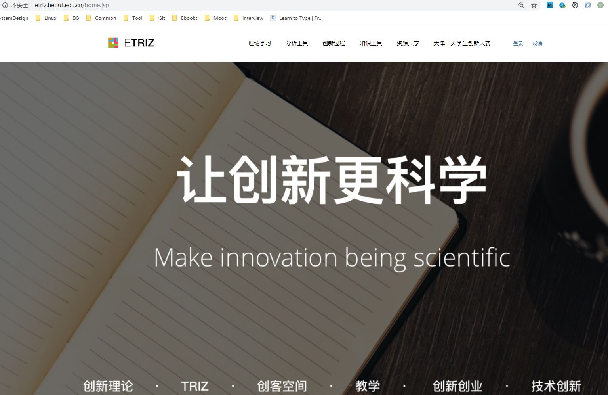
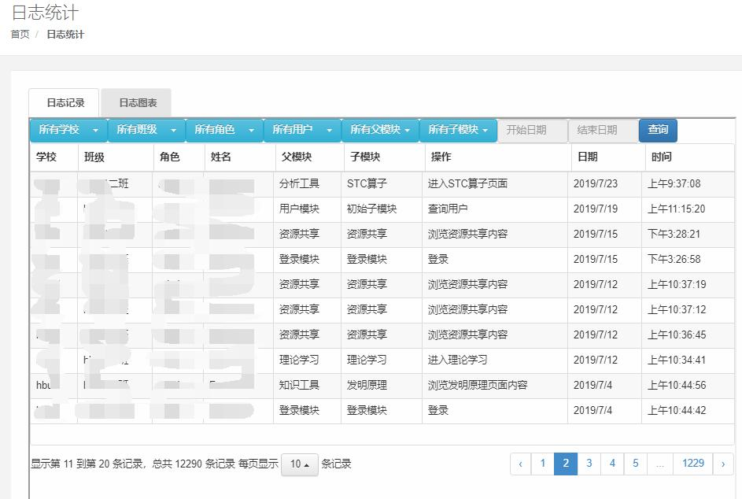
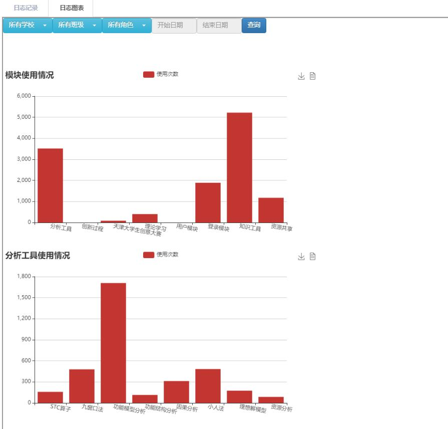

# EtrizDoc
项目地址（可能不能访问）: [http://etriz.hebut.edu.cn](http://etriz.hebut.edu.cn) 

因为学校网络中心出问题了，ETRIZ的域名暂时不能用:( ，所以简历里面的URL就指向了这个静态网页。如果您感兴趣的话:)，下面是我负责的模块所用到技术的详细描述：  

- 项目的首页大体是下面这样子，一共分为六个模块，每个模块中都有相应的练习题和知识点。



- 下面是我负责的日志模块最终实现的一个展示效果。当记录完用户日志以后，分别用BootStrap的表格插件和Echarts展示日志信息  





# 记录用户行为日志模块实现描述
主要用到了自定义注解结合Spring AOP做的实现。 下面是实现的思路以及伪码描述  

1.首先定义两个注解，分别用来修饰类和类中的方法。修饰类的注解描述了用户是在哪一个模块执行的操作，修饰方法的注解描述了用户具体执行了什么操作，下面是相应的**伪码**

```java
/**
 * 描述每个类所对应的模块。
 * 
 * @date: 2018/9/19
 * @author JS
 */
@Target({ElementType.Type})
@Retention(RetentionPolicy.RUNTIME)
public @interface ModuleOperation {

    String module() default "初始父模块";

    String subModule() default "初始子模块";

}

/**
 * 描述每个方法所对应的具体操作。
 * 
 * @date: 2018/9/19
 * @author JS
 */
@Target({ElementType.METHOD})
@Retention(RetentionPolicy.RUNTIME)
public @interface APIOperation {

    String description()  default "初始操作";

}
```

2.然后在Spring AOP的pointcut中关于这两个注解织入相应的advice，下面是相应的**伪码**  

```java
/**
 * 获取用户在平台上产生的行为日志。
 * @date 2019/6/19
 * @author JS
 * */
@Aspect
@Component
@Slf4j
public class UserLog {

    /**
     * 拦截自定义的注解
     *
     * */
    @Pointcut("@annotation(cn.etriz.annotation.APIOperation)")
    public void ApiAspect() {}

    @After("ApiAspect()")
    public void doAfter(JoinPoint joinPoint) {
        // 通过joinPoint获取方法签名
        MethodSignature method = (MethodSignature)joinPoint.getSignature();
        // 获取修饰方法的自定义注解
        APIOperation apiOperation = method.getMethod().getAnnotation(APIOperation.class);
        // 获取修饰类的自定义注解
        ModuleOperation moduleOperation = joinPoint.getTarget().getClass().getDeclaredAnnotation(ModuleOperation.class);
        // 获取类注解中描述的具体模块以及方法注解中描述的具体操作，记录到数据库中....
        if (apiOperation != null || moduleOperation == null) {
            log.debug("请求父模块:[{}]， 请求子模块:[{}]", moduleOperation.model(), moduleOperation,subModule());
            log.debug("具体操作:[{}]", apiOperation.description());
        }
        // ....
    }

}
```

# 避免XSS漏洞的思路描述
因为当用户注册完以后，后台会重新展示用户注册的信息。主要是这里出现了XSS漏洞。实现思路是前台对用户输入的信息做了限制，禁止输入一些script，iframe标签，再就是后台对用户注册的信息进行了转义。
